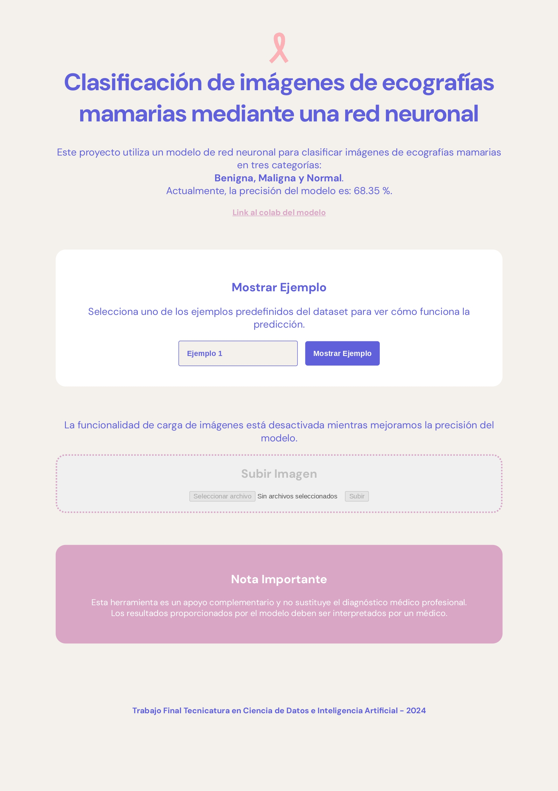
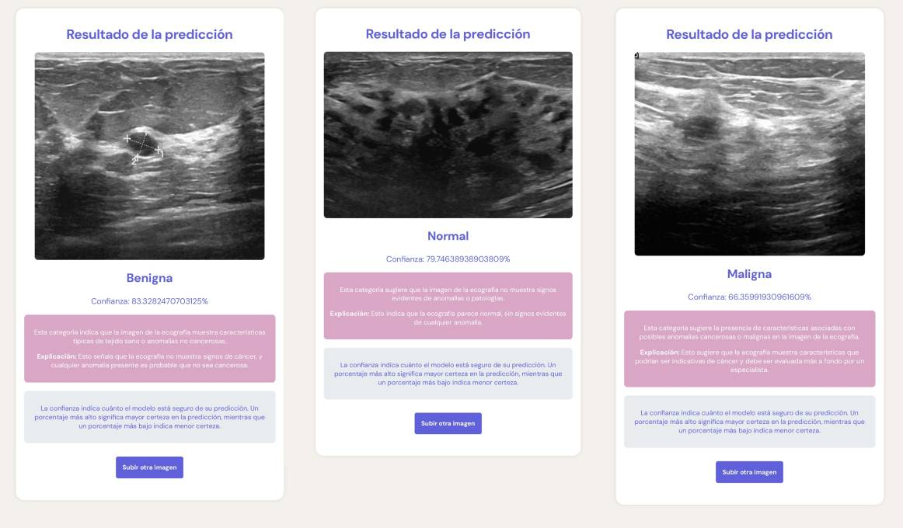

## Trabajo Final Tecnicatura en Ciencia de Datos e Inteligencia Artificial

Alumnos/as:

- BADIN, Maria Paula ( badin.mp@gmail.com )
- GARCÍA ALARCÓN, Rubí Nohemi ( rubialark@gmail.com )
- JURE, Juan ( juansjure@gmail.com )
- KLER, Micaela ( micakler@gmail.com )
- LAMAS, Liliana Elizabet (lililamase@gmail.com)
- MECHEDOU, Lamine ( lmechedou@gmail.com )

 # Clasificación de imágenes de ecografía mamaria mediante una red neuronal
El proyecto se centra en la clasificación automática de imágenes de ecografías mamarias para detectar si las lesiones presentes son malignas, benignas o normales. Este tipo de tecnología puede asistir a los profesionales de la salud en el diagnóstico temprano del cáncer de mama, mejorando las tasas de supervivencia mediante la identificación rápida y precisa de lesiones cancerosas. El modelo se entrena utilizando una red neuronal convolucional (CNN) para automatizar el proceso de diagnóstico.

### Ver código del modelo entrenado:
[Enlace al Google Colab](https://colab.research.google.com/drive/1dIXyRgV4inreiS_KVja4_NFsx-NO0h3L?usp=sharing#scrollTo=GL-6t2q0HSTf)

### Lenguajes y librerias utilizadas para esta interfaz de usuario
- Python
- Flask
- TensorFlow
- Numpy
- Requests

## Configuración del Proyecto

1. Primero, clona el repositorio.
2. Crea el entorno virtual para el proyecto
3. Instala los paquetes necesarios utilizando el archivo requirements.txt dentro del entorno usando pip:
   ```bash
   $ pip install -r requirements.txt
4. Ejecuta `app.py`.
5. La Aplicación Web estará alojada en `127.0.0.1:5000`.

<h2 align="center">Interfaz</h2>
<p align="center">Página de inicio</p>
<div align="center">

</div>
<br>
<p align="center">Resultados de la predicción</p>
<div align="center">

</div>
